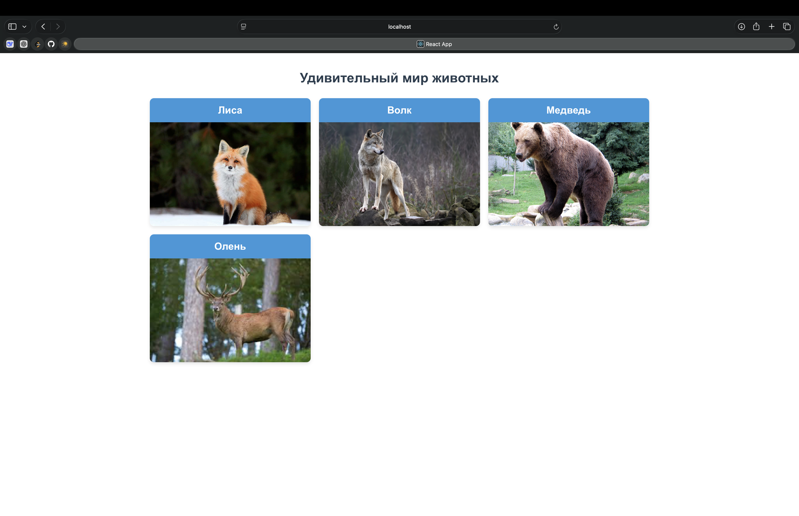

# Карточки животных

React-приложение для отображения карточек с различными животными.

## 📸 Скриншоты

### Главный экран приложения
 

## Архитектура и ключевые решения

*   Приложение разбито на переиспользуемые компоненты (`App`, `AnimalCard`).
*   Данные о животных хранятся в состоянии компонента `App` с помощью хука `useState`.
*   Для рендеринга списка карточек используется метод `map()`, каждому элементу передан уникальный `key`.
*   Использованы CSS-модули для предотвращения конфликтов имен классов и обеспечения модульности стилей.
*   Данные передаются от родительского компонента (`App`) к дочернему (`AnimalCard`) через пропсы.

## Чтобы запустить проект

* в папке "animals-cards" запустите "npm start"

## Отчёт о работе 

В ходе работы над этим проектом я ознакомился со структурой проектов на react, научился разворачивать react приложение, устанавливать все нужные зависимости, а также познакомился с основными особенностями приложений на React.